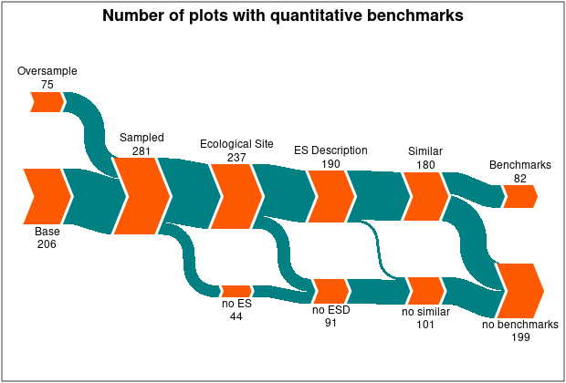

\vspace{-1cm}

```{r setup, include=FALSE}
knitr::opts_chunk$set(echo = F)
knitr::opts_chunk$set(dpi = 300) 
knitr::opts_chunk$set(message = F)
knitr::opts_chunk$set(warning = F)
```

An *ecological site* is an area of land which has similar environmental conditions, e.g. climate & soils, and which will produce similar types of vegetation when both undisturbed and when subjected to the same type of disturbance, e.g. by wildfire (@butler2003national). The idea of Ecological Sites is a broad system of models, each of which seeks to capture these re-occurring motifs of climate and soils across the landscape in order to guide land managers decisions at geographic levels at which they may effectively achieve desired outcomes, e.g. the level of allotment. The aggregation of areas across the *landscape* reduce the amount of monitoring and research required to make informed land management decisions, and allow for the transfer of successful practices from one area to another. Each Ecological Site is a concept which inherently captures a range of variation across the landscape, and each site features varying degrees of dissimilarity. However given the resources available to land managers they form the most thorough and useful model for classifying natural lands.

Ecological Sites are developed by the Natural Resource Conservation System (NRCS). While the current conception of what an Ecological Site is has theoretical roots in the science of Ecology nearly 100 years ago, the formulation of specific Ecological Sites under the current paradigm began around 1997 (@brown2010ecological, @karl2010monitoring). There popularity was a response to the failure of 'one size fits all' management decisions which were common throughout the 20^th^ century (@bestelmeyer2010introduction). The existence of Ecological Sites allow more fine tuned assessments of the possibilities which exist at each site, i.e. they can incorporate the number and identity of plant species and their annual growth and land managers can compare the current status of these attributes to the possibilities (@brown2010ecological). Based on what multiple uses occur for this land, it can then be managed to maximize it's benefits to all public land users.

The implementation of describing Ecological Sites by the NRCS occurs at the level of *Major Land Resource Areas (MLRA)*, and the  *Land Resource Units (LRU)* within them. Different MLRA's, and the LRU's within them, are at varying states of completion. Anecdotally, nearly all ecological sites have been established for MLRA 34b, 36, while few have been developed for MLRA 46; in general more arid LRU's are more likely to have complete ecological sites relative to more mesic areas.  MLRA 34b and 36 cover virtually all UFO land west of the foothills of the Cimarron, except for the highest elevation areas adjacent to Forest Service. Subsequent to the identification of an individual ecological site is recording and documenting a variety of it's ecological  parameters in a written format known as an *'Ecological Site Description'* (@bestelmeyer2010introduction). These documents follow a standardized format, but also vary in the degree of information which they contain. For example, most descriptions contain tables which include the *state and transitions models* which occur between vegetation, contain production values for vegetation in a *reference* state and phase, however some will contain production values for multiple states and phases (@bestelmeyer2010practical). Given the amount of detail and expert knowledge required in the identification and development of an ES and then to write the description of there developement is a time intensive process (@bestelmeyer2010practical, @moseley2010ecological). 

An important attribute of an Ecological Site Description (ESD) are *benchmarks*, ranges of attributes which reflect the variation observed in that ES while the area is in a certain state and phase. Benchmarks provide quantitative references to which land managers may compare lands to in order to contextualize there current status (@bestelmeyer2010practical).

> "_In other words, the ecological site determines what is possible, the current state determines what is realistic, and the phase within a state conveys the current conditions and likelihood of future transitions._"
>  
> `r tufte::quote_footer('--- Karl & Herrick 2010')`

We endeavor to make all management decisions based on the quantitative benchmarks in ESD's. Here we summarize the current levels of completion of ESD's across the UFO field office. As our management objectives rely on these benchmarks values to determine whether our land is within the range of natural variability, they are an essential component of this.


```{r load libraries}
library(tidyverse)
library(PantaRhei)
library(grid) 
```

```{r import data}

pp <- '../data/processed'
f <- list.files(pp, pattern = 'csv')

transcription <- read.csv(file.path(pp, f[grep('Transcription', f)])) %>% 
  distinct(ECO.SITE, .keep_all = T) %>% 
  select(ECO.SITE:QUANTITATIVE.BENCHMARKS, -PLOTS) %>% 
  mutate(across(.cols = 2:4,  ~ if_else(.x == 'DONE', 1, 0)))

tracking <- read.csv(file.path(pp, f[grep('Tracking', f)]))
benchmarks <- read.csv(file.path(pp, f[grep('*.REF', f)]))
production <- read.csv(file.path(pp, f[grep('Production', f)]))
stateTransition <- read.csv(file.path(pp, f[grep('Ordered', f )]))

benchmarks <- benchmarks %>% 
  distinct(ECO.SITE) %>% 
  mutate(QUANTITATIVE.BENCHMARKS = 1)

rm(pp, f)
rm(production, stateTransition)
```

```{r collect quant values for writeup, echo = F}
tracking_vals <- tracking %>% 
  filter(#str_detect(PANEL, 'oversample', negate = T) & 
                                  ECO.SITE.MATCHED == TRUE) %>% 
  select(ECO.SITE) %>% 
  left_join(., transcription, by = 'ECO.SITE') 

no.ES <- tracking %>% filter(STATUS == 'SAMPLED' & ECO.SITE.MATCHED == T) %>% 
  distinct(ECO.SITE) %>% nrow()

correlated <- tracking %>% 
  filter(ECO.SITE.MATCHED == T) %>% 
  nrow()
  
plots_w_ESD <- nrow(tracking_vals) # 155 base plots have ESDS

plots_sampled <- tracking %>% # total number of plots sampled
  filter(STATUS == 'SAMPLED') %>% 
  nrow()

bp_sampled <- tracking %>% # the number of base plots which were sampled
  filter(str_detect(PANEL, 'oversample', negate = T), STATUS == 'SAMPLED') %>% 
  nrow()

ov_sampled <- tracking %>% # the number of over sample plots sampled
   filter(str_detect(PANEL, 'oversample')) %>% 
   nrow()

benchmarks <- benchmarks %>% 
  distinct(ECO.SITE) %>% 
  mutate(QUANTITATIVE.BENCHMARKS = 1)

rm(tracking_vals, transcription, tracking)
```


```{r Plots per ESD, eval = F}

esUFO %>% 
  left_join(., benchmarks, by = 'ECO.SITE') %>% 
  mutate(QUANTITATIVE.BENCHMARKS = replace_na(QUANTITATIVE.BENCHMARKS, 0),
         QUANTITATIVE.BENCHMARKS = if_else(str_detect(QUANTITATIVE.BENCHMARKS, '1'), 'Present', 'Absent')) %>% 
  
  ggplot() +
  geom_point(aes(x = fct_rev(fct_reorder(ECO.SITE, n)), y = n, color = QUANTITATIVE.BENCHMARKS),  size = 4) +
  scale_colour_manual('Vegetation\nBenchmarks', values = c('Present' = 'grey75', 'Absent' = 'black' )) +
  labs(x = NULL, y = 'Number of Plots', title = 'AIM plots per Ecological Site') +
  theme_classic() +
  scale_y_continuous(breaks=c(0,5,10, 20, 30)) + 
  theme(
    axis.text.x = element_text(angle = 45, hjust =1,  size= 6),
    axis.ticks.x=element_blank(),
    axis.line.y.left = element_blank(),
    axis.line.x.bottom = element_blank(),
    plot.title = element_text(hjust = 0.5),
    legend.title = element_text(hjust = 0.5),
    legend.position = c(0.85, 0.75)
    ) 

ggsave('../results/graphics/PlotsPerESD.png')
```

## Results and Discussion

\begin{wrapfigure}{r}{0.4\textwidth}
  \centering
    \includegraphics[width=0.4\textwidth]{../results/graphics/PlotsPerESD.png}
  \caption{The number of AIM plots correlated to each Ecological Site, and whether each site has a written Description}
\end{wrapfigure}

Ideally, it would be possible to correlate every single AIM plot an Ecological Site, and the description (ESD) for that site would be completed. This is unlikely due to two constraints, 1) the NRCS soil survey components can contain inclusions which are up to 15% of the area, 2) not all ESDs have been completed, and many are at varying stages of completion. While these provide limits on the information which can be gleaned from each plot for specialized management decisions, statistical procedures exist which allow for inference of overall land conditions regardless. 

Of the `r plots_sampled` plots sampled by the AIM crews `r correlated` were correlated to an ecological site, with a total of `r toString(no.ES)` unique Ecological Sites being sampled in the first AIM sample frame. As can be seen in Figure 1, most plots are located in just a few Ecological Sites, and most Ecological Sites had only a few plots sampled in them. As the plot locations were randomly stratified, this indicates that a few Ecological Sites make up much of the the Field Office. A few of the most common Ecological Sites are missing completed Descriptions. The lack of these few descriptions disproportionately affects the number of plots with existing quantitative benchmarks. 

Of all `r plots_sampled` plots sampled the total with the full set of quantitative benchmarks is 88. Roughly `r paste0(round((1 - correlated / plots_sampled) * 100, 0), '%')` of plots were not correlated to and Ecological Site, a proportion close to the 15% tolerance for inclusions across the map units. Of the plots which were correlated 47 were in Ecological Sites which do not yet have an Ecological Site Description which has made it to the publicly available draft stage. Of the 190 plots with ESD's, only 82 of these have quantitative benchmarks. Because of this, a variety of approaches will be used to estimate the quantitative benchmark values associated with many Ecological Sites. With the exception of the vegetation benchmarks, these will be discussed in each section.

{height=55%, width=55%}

```{r Sankey version two, eval = F}

nodes <- data.frame(
  ID = c(
    'OS', 'BP', 'SAMPLED', 
    'ECO.SITE', 'N.ECO.SITE',
    'ESD', 'N.ESD', 
    'SIMILAR', 'N.SIMILAR', 
    'BM', 'N.BM'
         ),
  label = c(
    'Oversample', 'Base', 'Sampled',
    'Ecological Site', 'no ES', 
    'ES Description', 'no ESD', 
    'Similar', 'no similar',
    'Benchmarks', 'no benchmarks'),
  x = c(1, 1, 2, 3, 3, 4, 4, 5, 5, 6, 6),
  y = c(3, 2, 2, 2, 1, 2, 1, 2, 1, 2, 1),
  label_pos = c(c('above', 'below', 'above'), rep(c('above', 'below'), times = 4))
)

df <- data.frame(
  from = c(
    'OS', 'BP', 'SAMPLED', 'SAMPLED',
    'ECO.SITE', 'ECO.SITE', 'N.ECO.SITE',
    'ESD', 'ESD', 'N.ESD',
    'SIMILAR', 'SIMILAR', 'N.SIMILAR'),
  to = c(
    'SAMPLED', 'SAMPLED', 'ECO.SITE', 'N.ECO.SITE',
    'ESD', 'N.ESD', 'N.ESD',
    'SIMILAR', 'N.SIMILAR', 'N.SIMILAR',
    'BM', 'N.BM', 'N.BM'), 
  quantity = c(
    75, 206, 237, 44, 
    190, 47, 44,
    180, 10, 91,
    82, 98, 101)
)

colors <- data.frame(substance = "<any>", color = "#008083")
ns <- list(type="arrow", gp=gpar(fill="#FD5901", col="white", lwd=4), mag_pos = 'label', mag_fmt="%.0f")
my_title <- "Number of plots with quantitative benchmarks"
attr(my_title, "gp") <- gpar(fontsize=18, fontface="bold")

png('../results/graphics/Sankey_plots.png', width = 620, height = 420)
sankey(nodes, flows = df, node_style=ns, legend=F, colors, 
       page_margin=c(0.0, -1.2, 0.0, -1.1), 
       title = my_title)
dev.off()

rm(colors, ns, df, nodes, my_title)
```

```{r}
rm(bp_sampled, correlated, ov_sampled, plots_sampled, plots_w_ESD, no.ES, benchmarks)
```

# References

\small

